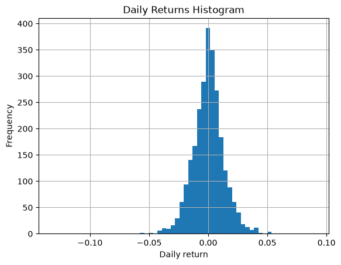
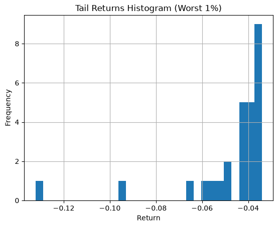
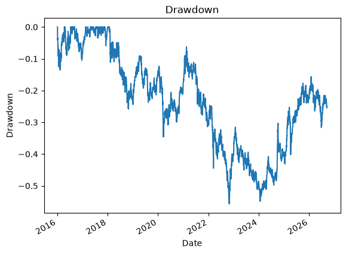

```python
import pandas as pd
import numpy as np
import matplotlib.pyplot as plt
import yfinance as yf
from scipy.stats import norm
```

## 1. Data and Returns


```python
target = "^HSI"
df = yf.download(target, start = "2016-01-01")['Close']
df = df.squeeze() # Convert to Series
returns = df.pct_change().dropna()

df, returns
```

    
[*********************100%***********************]  1 of 1 completed

    


    (Date
     2016-01-04    21327.119141
     2016-01-05    21188.720703
     2016-01-06    20980.810547
     2016-01-07    20333.339844
     2016-01-08    20453.710938
                       ...     
     2026-09-09    25274.960938
     2026-09-10    24954.470703
     2026-09-11    24805.630859
     2026-09-14    24917.599609
     2026-09-15    24721.570312
     Name: ^HSI, Length: 2632, dtype: float64,
     Date
     2016-01-05   -0.006489
     2016-01-06   -0.009812
     2016-01-07   -0.030860
     2016-01-08    0.005920
     2016-01-11   -0.027634
                     ...   
     2026-09-09   -0.001668
     2026-09-10   -0.012680
     2026-09-11   -0.005964
     2026-09-14    0.004514
     2026-09-15   -0.007867
     Name: ^HSI, Length: 2631, dtype: float64)


## 2. Return Diagnostics


```python
summary = pd.DataFrame({
    "mean_daily": [returns.mean()],
    "vol_daily": [returns.std()],
    "min_daily": [returns.min()],
    "max_daily": [returns.max()],
    "n_obs": [returns.shape[0]],
})
summary
```


<div>
<style scoped>
    .dataframe tbody tr th:only-of-type {
        vertical-align: middle;
    }

    .dataframe tbody tr th {
        vertical-align: top;
    }

    .dataframe thead th {
        text-align: right;
    }
</style>
<table border="1" class="dataframe">
  <thead>
    <tr style="text-align: right;">
      <th></th>
      <th>mean_daily</th>
      <th>vol_daily</th>
      <th>min_daily</th>
      <th>max_daily</th>
      <th>n_obs</th>
    </tr>
  </thead>
  <tbody>
    <tr>
      <th>0</th>
      <td>0.000151</td>
      <td>0.013771</td>
      <td>-0.132233</td>
      <td>0.090818</td>
      <td>2631</td>
    </tr>
  </tbody>
</table>
</div>


```python
plt.figure()
returns.hist(bins=60)
plt.title("Daily Returns Histogram")
plt.xlabel("Daily return")
plt.ylabel("Frequency")
plt.show()
```


    

    


## 3. Historical VaR


```python
CL_95 = 0.95
CL_99 = 0.99

var_hist_95 = np.percentile(returns, (1-CL_95) * 100)
var_hist_99 = np.percentile(returns, (1-CL_99) * 100)

pd.DataFrame({
    "VaR type": ["Historical", "Historical"],
    "Confidence": [CL_95, CL_99],
    "VaR (return)": [var_hist_95, var_hist_99],
})
```


<div>
<style scoped>
    .dataframe tbody tr th:only-of-type {
        vertical-align: middle;
    }

    .dataframe tbody tr th {
        vertical-align: top;
    }

    .dataframe thead th {
        text-align: right;
    }
</style>
<table border="1" class="dataframe">
  <thead>
    <tr style="text-align: right;">
      <th></th>
      <th>VaR type</th>
      <th>Confidence</th>
      <th>VaR (return)</th>
    </tr>
  </thead>
  <tbody>
    <tr>
      <th>0</th>
      <td>Historical</td>
      <td>0.95</td>
      <td>-0.021004</td>
    </tr>
    <tr>
      <th>1</th>
      <td>Historical</td>
      <td>0.99</td>
      <td>-0.034047</td>
    </tr>
  </tbody>
</table>
</div>


## 4. Parametric VaR


```python
mean = returns.mean()
std = returns.std()

var_param_95 = norm.ppf(1 - CL_95,loc=mean, scale=std)
var_param_99 = norm.ppf(1 - CL_99,loc=mean, scale=std)

pd.DataFrame({
    "VaR type": ["Parametric (Normal)", "Parametric (Normal)"],
    "Confidence": [CL_95, CL_99],
    "VaR (return)": [var_param_95, var_param_99],
})
```


<div>
<style scoped>
    .dataframe tbody tr th:only-of-type {
        vertical-align: middle;
    }

    .dataframe tbody tr th {
        vertical-align: top;
    }

    .dataframe thead th {
        text-align: right;
    }
</style>
<table border="1" class="dataframe">
  <thead>
    <tr style="text-align: right;">
      <th></th>
      <th>VaR type</th>
      <th>Confidence</th>
      <th>VaR (return)</th>
    </tr>
  </thead>
  <tbody>
    <tr>
      <th>0</th>
      <td>Parametric (Normal)</td>
      <td>0.95</td>
      <td>-0.022500</td>
    </tr>
    <tr>
      <th>1</th>
      <td>Parametric (Normal)</td>
      <td>0.99</td>
      <td>-0.031885</td>
    </tr>
  </tbody>
</table>
</div>


```python
compare_var = pd.DataFrame({
    "Historical VaR (return)": [var_hist_95, var_hist_99],
    "Parametric VaR (return)": [var_param_95, var_param_99],
})
compare_var
```


<div>
<style scoped>
    .dataframe tbody tr th:only-of-type {
        vertical-align: middle;
    }

    .dataframe tbody tr th {
        vertical-align: top;
    }

    .dataframe thead th {
        text-align: right;
    }
</style>
<table border="1" class="dataframe">
  <thead>
    <tr style="text-align: right;">
      <th></th>
      <th>Historical VaR (return)</th>
      <th>Parametric VaR (return)</th>
    </tr>
  </thead>
  <tbody>
    <tr>
      <th>0</th>
      <td>-0.021004</td>
      <td>-0.022500</td>
    </tr>
    <tr>
      <th>1</th>
      <td>-0.034047</td>
      <td>-0.031885</td>
    </tr>
  </tbody>
</table>
</div>


## 5. VaR Backtesting


```python
var_threshold = var_hist_95

exceptions = returns < var_threshold
exception_rate = exceptions.mean()

pd.DataFrame({
    "VaR model": ["Historical 95% (constant)"],
    "VaR threshold (return)": [var_threshold],
    "exception_rate": [exception_rate],
    "expected_rate": [1-CL_95],
    "n_exceptions": [exceptions.sum()],
    "n_total": [len(exceptions)],
})
```


<div>
<style scoped>
    .dataframe tbody tr th:only-of-type {
        vertical-align: middle;
    }

    .dataframe tbody tr th {
        vertical-align: top;
    }

    .dataframe thead th {
        text-align: right;
    }
</style>
<table border="1" class="dataframe">
  <thead>
    <tr style="text-align: right;">
      <th></th>
      <th>VaR model</th>
      <th>VaR threshold (return)</th>
      <th>exception_rate</th>
      <th>expected_rate</th>
      <th>n_exceptions</th>
      <th>n_total</th>
    </tr>
  </thead>
  <tbody>
    <tr>
      <th>0</th>
      <td>Historical 95% (constant)</td>
      <td>-0.021004</td>
      <td>0.050171</td>
      <td>0.05</td>
      <td>132</td>
      <td>2631</td>
    </tr>
  </tbody>
</table>
</div>


```python
var_threshold = var_hist_99

exceptions = returns < var_threshold
exception_rate = exceptions.mean()

pd.DataFrame({
    "VaR model": ["Historical 99% (constant)"],
    "VaR threshold (return)": [var_threshold],
    "exception_rate": [exception_rate],
    "expected_rate": [1-CL_99],
    "n_exceptions": [exceptions.sum()],
    "n_total": [len(exceptions)],
})
```


<div>
<style scoped>
    .dataframe tbody tr th:only-of-type {
        vertical-align: middle;
    }

    .dataframe tbody tr th {
        vertical-align: top;
    }

    .dataframe thead th {
        text-align: right;
    }
</style>
<table border="1" class="dataframe">
  <thead>
    <tr style="text-align: right;">
      <th></th>
      <th>VaR model</th>
      <th>VaR threshold (return)</th>
      <th>exception_rate</th>
      <th>expected_rate</th>
      <th>n_exceptions</th>
      <th>n_total</th>
    </tr>
  </thead>
  <tbody>
    <tr>
      <th>0</th>
      <td>Historical 99% (constant)</td>
      <td>-0.034047</td>
      <td>0.010262</td>
      <td>0.01</td>
      <td>27</td>
      <td>2631</td>
    </tr>
  </tbody>
</table>
</div>


```python
var_threshold = var_param_95

exceptions = returns < var_threshold
exception_rate = exceptions.mean()

pd.DataFrame({
    "VaR model": ["Parametric 95% (constant)"],
    "VaR threshold (return)": [var_threshold],
    "exception_rate": [exception_rate],
    "expected_rate": [1-CL_95],
    "n_exceptions": [exceptions.sum()],
    "n_total": [len(exceptions)],
})
```


<div>
<style scoped>
    .dataframe tbody tr th:only-of-type {
        vertical-align: middle;
    }

    .dataframe tbody tr th {
        vertical-align: top;
    }

    .dataframe thead th {
        text-align: right;
    }
</style>
<table border="1" class="dataframe">
  <thead>
    <tr style="text-align: right;">
      <th></th>
      <th>VaR model</th>
      <th>VaR threshold (return)</th>
      <th>exception_rate</th>
      <th>expected_rate</th>
      <th>n_exceptions</th>
      <th>n_total</th>
    </tr>
  </thead>
  <tbody>
    <tr>
      <th>0</th>
      <td>Parametric 95% (constant)</td>
      <td>-0.0225</td>
      <td>0.038008</td>
      <td>0.05</td>
      <td>100</td>
      <td>2631</td>
    </tr>
  </tbody>
</table>
</div>


```python
var_threshold = var_param_99

exceptions = returns < var_threshold
exception_rate = exceptions.mean()

pd.DataFrame({
    "VaR model": ["Parametric 99% (constant)"],
    "VaR threshold (return)": [var_threshold],
    "exception_rate": [exception_rate],
    "expected_rate": [1-CL_99],
    "n_exceptions": [exceptions.sum()],
    "n_total": [len(exceptions)],
})
```


<div>
<style scoped>
    .dataframe tbody tr th:only-of-type {
        vertical-align: middle;
    }

    .dataframe tbody tr th {
        vertical-align: top;
    }

    .dataframe thead th {
        text-align: right;
    }
</style>
<table border="1" class="dataframe">
  <thead>
    <tr style="text-align: right;">
      <th></th>
      <th>VaR model</th>
      <th>VaR threshold (return)</th>
      <th>exception_rate</th>
      <th>expected_rate</th>
      <th>n_exceptions</th>
      <th>n_total</th>
    </tr>
  </thead>
  <tbody>
    <tr>
      <th>0</th>
      <td>Parametric 99% (constant)</td>
      <td>-0.031885</td>
      <td>0.012543</td>
      <td>0.01</td>
      <td>33</td>
      <td>2631</td>
    </tr>
  </tbody>
</table>
</div>


## 6. Tail Risk


```python
tail_q = 0.01
tail_cutoff = returns.quantile(tail_q)
tail_returns = returns[returns <= tail_cutoff]

tail_stats = pd.DataFrame({
    "tail_quantile": [tail_q],
    "tail_cutoff (return)": [tail_cutoff],
    "avg_tail_return": [tail_returns.mean()],
    "min_tail_return": [tail_returns.min()],
    "n_tail_obs": [len(tail_returns)],
})
tail_stats
```


<div>
<style scoped>
    .dataframe tbody tr th:only-of-type {
        vertical-align: middle;
    }

    .dataframe tbody tr th {
        vertical-align: top;
    }

    .dataframe thead th {
        text-align: right;
    }
</style>
<table border="1" class="dataframe">
  <thead>
    <tr style="text-align: right;">
      <th></th>
      <th>tail_quantile</th>
      <th>tail_cutoff (return)</th>
      <th>avg_tail_return</th>
      <th>min_tail_return</th>
      <th>n_tail_obs</th>
    </tr>
  </thead>
  <tbody>
    <tr>
      <th>0</th>
      <td>0.01</td>
      <td>-0.034047</td>
      <td>-0.04744</td>
      <td>-0.132233</td>
      <td>27</td>
    </tr>
  </tbody>
</table>
</div>


```python
plt.figure()
tail_returns.hist(bins=30)
plt.title("Tail Returns Histogram (Worst 1%)")
plt.xlabel("Return")
plt.ylabel("Frequency")
plt.show()
```


    

    


## 7. Stress Testing


```python
portfolio_value = 1_000_000

shocks = [-0.03, -0.05, -0.10]
stress_table = pd.DataFrame({
    "shock_return": shocks,
    "stress_pnl": [shock * portfolio_value for shock in shocks]
})
stress_table
```


<div>
<style scoped>
    .dataframe tbody tr th:only-of-type {
        vertical-align: middle;
    }

    .dataframe tbody tr th {
        vertical-align: top;
    }

    .dataframe thead th {
        text-align: right;
    }
</style>
<table border="1" class="dataframe">
  <thead>
    <tr style="text-align: right;">
      <th></th>
      <th>shock_return</th>
      <th>stress_pnl</th>
    </tr>
  </thead>
  <tbody>
    <tr>
      <th>0</th>
      <td>-0.03</td>
      <td>-30000.0</td>
    </tr>
    <tr>
      <th>1</th>
      <td>-0.05</td>
      <td>-50000.0</td>
    </tr>
    <tr>
      <th>2</th>
      <td>-0.10</td>
      <td>-100000.0</td>
    </tr>
  </tbody>
</table>
</div>


```python
N = 10
worst_days = returns.nsmallest(N)
hist_stress = pd.DataFrame({
    "date": worst_days.index,
    "return": worst_days.values,
    "pnl": worst_days.values * portfolio_value,
}).reset_index(drop=True)
hist_stress
```


<div>
<style scoped>
    .dataframe tbody tr th:only-of-type {
        vertical-align: middle;
    }

    .dataframe tbody tr th {
        vertical-align: top;
    }

    .dataframe thead th {
        text-align: right;
    }
</style>
<table border="1" class="dataframe">
  <thead>
    <tr style="text-align: right;">
      <th></th>
      <th>date</th>
      <th>return</th>
      <th>pnl</th>
    </tr>
  </thead>
  <tbody>
    <tr>
      <th>0</th>
      <td>2025-04-07</td>
      <td>-0.132233</td>
      <td>-132233.471233</td>
    </tr>
    <tr>
      <th>1</th>
      <td>2024-10-08</td>
      <td>-0.094070</td>
      <td>-94069.740081</td>
    </tr>
    <tr>
      <th>2</th>
      <td>2022-10-24</td>
      <td>-0.063563</td>
      <td>-63563.139379</td>
    </tr>
    <tr>
      <th>3</th>
      <td>2022-03-15</td>
      <td>-0.057168</td>
      <td>-57167.699478</td>
    </tr>
    <tr>
      <th>4</th>
      <td>2020-05-22</td>
      <td>-0.055597</td>
      <td>-55596.665695</td>
    </tr>
    <tr>
      <th>5</th>
      <td>2018-02-06</td>
      <td>-0.051164</td>
      <td>-51164.195663</td>
    </tr>
    <tr>
      <th>6</th>
      <td>2022-03-14</td>
      <td>-0.049729</td>
      <td>-49729.463660</td>
    </tr>
    <tr>
      <th>7</th>
      <td>2020-03-23</td>
      <td>-0.048627</td>
      <td>-48626.881563</td>
    </tr>
    <tr>
      <th>8</th>
      <td>2020-03-09</td>
      <td>-0.042308</td>
      <td>-42307.834523</td>
    </tr>
    <tr>
      <th>9</th>
      <td>2021-07-27</td>
      <td>-0.042222</td>
      <td>-42221.941844</td>
    </tr>
  </tbody>
</table>
</div>


## 8. Drawdowns


```python
cum = (1 + returns).cumprod()
draw = cum / cum.cummax() - 1

draw_stats = pd.DataFrame({
    "max_drawdown" : [draw.min()],
    "max_drawdown_pnl" : [draw.min() * portfolio_value],
})
draw_stats
```


<div>
<style scoped>
    .dataframe tbody tr th:only-of-type {
        vertical-align: middle;
    }

    .dataframe tbody tr th {
        vertical-align: top;
    }

    .dataframe thead th {
        text-align: right;
    }
</style>
<table border="1" class="dataframe">
  <thead>
    <tr style="text-align: right;">
      <th></th>
      <th>max_drawdown</th>
      <th>max_drawdown_pnl</th>
    </tr>
  </thead>
  <tbody>
    <tr>
      <th>0</th>
      <td>-0.557008</td>
      <td>-557007.72493</td>
    </tr>
  </tbody>
</table>
</div>


```python
plt.figure()
draw.plot()
plt.title("Drawdown")
plt.xlabel("Date")
plt.ylabel("Drawdown")
plt.show()
```


    

    


## 9. Risk Report


```python
report = pd.DataFrame({
    "Metric": [
        f"Historical VaR {int(CL_95*100)}%",
        f"Parametric VaR {int(CL_95*100)}% (Assuming Normal)",
        f"Tail Loss (worst {int(tail_q*100)}%) avg",
        "Worst Drawdown",
        "Stress PnL (-10%)",
        f"Worst {N} days avg PnL",
    ],
    "Value": [
        var_hist_95 * portfolio_value,
        var_param_95 * portfolio_value,
        tail_returns.mean() * portfolio_value,
        draw.min() * portfolio_value,
        -0.10 * portfolio_value,
        hist_stress["pnl"].mean() if len(hist_stress) > 0 else np.nan,
    ]
})
report
```


<div>
<style scoped>
    .dataframe tbody tr th:only-of-type {
        vertical-align: middle;
    }

    .dataframe tbody tr th {
        vertical-align: top;
    }

    .dataframe thead th {
        text-align: right;
    }
</style>
<table border="1" class="dataframe">
  <thead>
    <tr style="text-align: right;">
      <th></th>
      <th>Metric</th>
      <th>Value</th>
    </tr>
  </thead>
  <tbody>
    <tr>
      <th>0</th>
      <td>Historical VaR 95%</td>
      <td>-21003.765329</td>
    </tr>
    <tr>
      <th>1</th>
      <td>Parametric VaR 95% (Assuming Normal)</td>
      <td>-22500.000465</td>
    </tr>
    <tr>
      <th>2</th>
      <td>Tail Loss (worst 1%) avg</td>
      <td>-47440.430335</td>
    </tr>
    <tr>
      <th>3</th>
      <td>Worst Drawdown</td>
      <td>-557007.724930</td>
    </tr>
    <tr>
      <th>4</th>
      <td>Stress PnL (-10%)</td>
      <td>-100000.000000</td>
    </tr>
    <tr>
      <th>5</th>
      <td>Worst 10 days avg PnL</td>
      <td>-63668.103312</td>
    </tr>
  </tbody>
</table>
</div>


